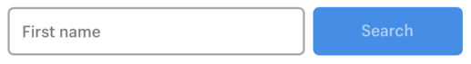
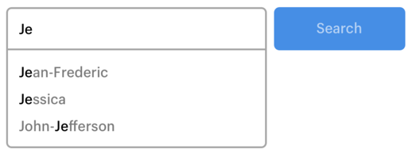

# Type ahead

Create a typeahead search field that provides suggestions based on what the user types. Note that this component would be added to our design system. We’ve included the base design but feel free to add anything that will improve the user experience.

## Mock ups

### Initial state



### With suggestions



### Design

The design is up to you, aside from these hypothetical brand guidelines for color.

* Input border: `#AAAAAA`
* Button background: `#4E8FDF`
* Button text color: `#B7D0F1`

## Data set

Data set to query in the implementation.

```
[
  "Jean-Frederic",
  "Jonathan",
  "Jessica",
  "Dominic",
  "John-Jefferson",
  "Cathryn",
  "Kaelig",
  "Monica",
  "Cynthia",
  "Peter",
  "Justin"
]
```

### Recommendations

* Because we don't have an API endpoint to hit for this, we suggest including it in your JavaScript file as an array of names assigned to a variable.
* Interviewer can AirDrop you the list to save time if you're using a Mac.

## Development environment

You are welcome to use the third-party view framework of your choice, or no framework at all.  Examples of view frameworks: Vue.js, React, Angular

However, you cannot use third-party libraries that bring in complete components with full interactions (JS), CSS and markup. Examples: Bootstrap, Material design. Reason: The purpose of the exercise is to see how you would build this component from scratch. We’ll want to have many opportunities to discuss the choices made along the way in mark-up, styling, and interactions.
